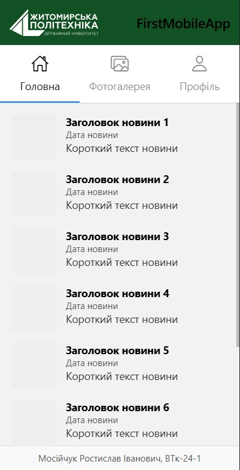
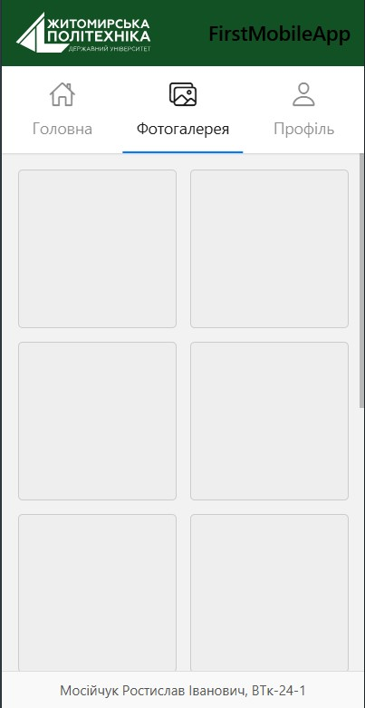
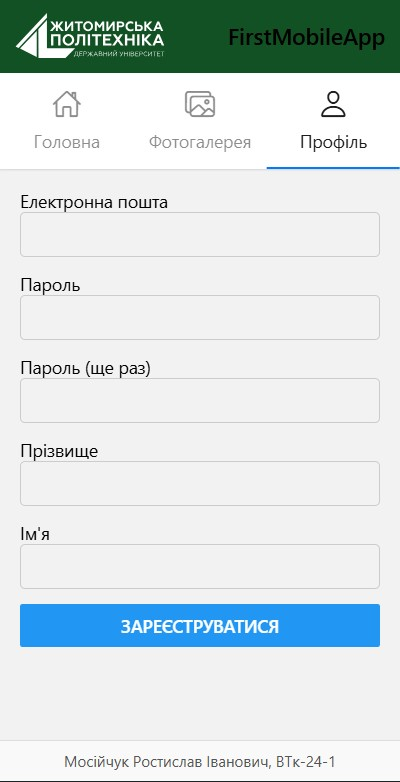

# MobileLab1RN2025

## Інструкція по запуску

Цей проєкт створено на базі Expo та React Native. Додаток містить три екрани: "Новини", "Фотогалерея" (верхня таб-навігація) та "Профіль" (реєстрація).

### Передумови

- Node.js (версія >= 14)
- npm або yarn
- Expo CLI
- Додаток Expo Go на мобільному пристрої

### Встановлення та запуск

1. Клонувати репозиторій:

   ```bash
   git clone https://github.com/vtk241-mri/MobileLab1RN2025.git
   cd MobileLab1RN2025
   ```

2. Встановити залежності:

   ```bash
   npm install
   # або
   yarn install
   ```

3. Запустити Metro Bundler:

   ```bash
   npx expo start
   # або, щоб очистити кеш
   npx expo start -c
   ```

4. У терміналі зʼявиться QR‑код.
   - Відкрийте на телефоні Expo Go
   - Скануйте QR‑код
   - Дочекайтесь завантаження проєкту на вашому пристрої

---

## Структура папок

```
Lab1/
├─ assets/
│  └─ logo.svg
├─ App.js
├─ package.json
└─ README.md
```

---

## Скріншоти екранів

### Новини



### Фотогалерея



### Реєстрація


